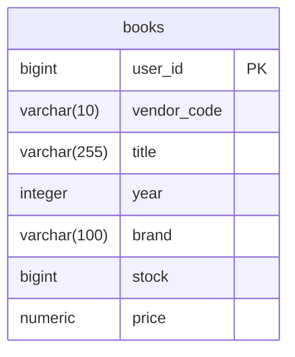

# Library (Test Task)
*A web application for managing books*

## 📌 Table of Contents
- [Key Features](#-key-features)
- [Tech Stack](#-tech-stack)
- [API Documentation](#api-documentation)
- [Database Schema](#-database-schema)
- [Quick Start](#-quick-start)
- [Contacts](#-contacts)

## 🌟 Key Features
### Book Managing
- ✅ CRUD operations
- 📊 Find books with filtration and pagination

## 🛠 Tech Stack
| Category       | Technologies                                                 |
|----------------|--------------------------------------------------------------|
| **Backend**     | Java 21, Spring Boot 3, Web, Data JPA, Validation, Thymeleaf |
| **Database**| PostgreSQL, Liquibase                                        |
| **Build Tool**     | Maven                                                        |

## API Documentation

[](https://documenter.getpostman.com/view/41252659/2sB2cYbf37)

## 📊 Database Schema



## ⚡ Quick Start
1. Clone repository:
```bash
git clone https://github.com/LoucterSo/books-test-task
cd books-test-task
```

2. Start the application:
```bash
mvn spring-boot:run
```
3. Stop the application:
```bash
mvn spring-boot:stop 
```

## 📧 Contacts
- Author: Vladislav Gorelkin
- 📧 Email: vlad_gorelkin@inbox.ru | loucterso@gmail.com
- 💻 GitHub: [LoucterSo](https://github.com/LoucterSo)
